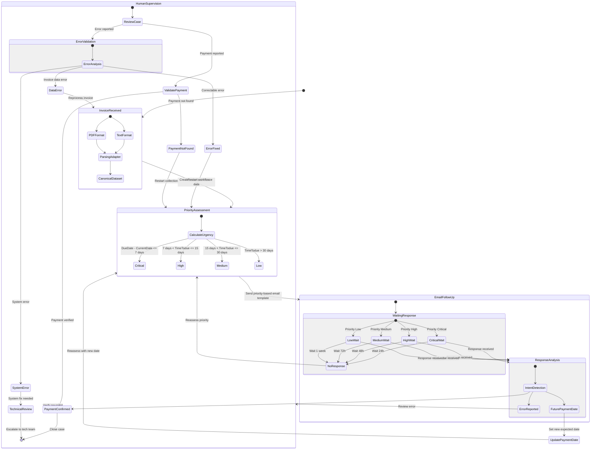

# Collection Workflow State Diagram

This diagram represents the states and transitions in the collection workflow process.

## State Descriptions

### Initial States
- **InvoiceReceived**: Initial state when an invoice is received in either PDF or Text format
- **ParsingAdapter**: Selection and application of appropriate parser based on input format
- **CanonicalDataset**: Standardized invoice data structure created

### Priority States
- **Critical**: Due date is within 7 days or overdue
- **High**: Due date is between 8-15 days
- **Medium**: Due date is between 16-30 days
- **Low**: Due date is more than 30 days away

### Email Communication States
- **InitialEmailSent**: Priority-based email template sent to client
- **WaitingResponse**: Different waiting periods based on priority:
  - Critical: 24 hours wait
  - High: 48 hours wait
  - Medium: 72 hours wait
  - Low: 1 week wait
- **ResponseAnalysis**: Processing and analyzing client's response

### Response Handling States
- **PaymentConfirmed**: Client indicates payment has been made
- **ErrorReported**: Client reports an issue with the invoice
- **FuturePaymentDate**: Client commits to a future payment date

### Human Supervision States
- **ReviewCase**: Initial human review of the case
- **ValidatePayment**: Verification of reported payments
- **ErrorValidation**: Analysis and categorization of reported errors:
  - **ErrorFixed**: Correctable errors that can resume workflow
  - **DataError**: Errors requiring invoice reprocessing
  - **SystemError**: Technical issues requiring escalation
- **PaymentNotFound**: Payment verification failed, restart collection
- **TechnicalReview**: System issues requiring technical team intervention

## Transitions
- System automatically calculates priority based on due date
- Email follow-up frequency varies by priority level
- Priority is reassessed after each no-response cycle
- Future payment dates trigger priority reassessment
- Human supervision can trigger workflow restarts:
  - After error correction
  - When payment verification fails
  - When invoice data needs reprocessing
- Technical issues are escalated to specialized teams